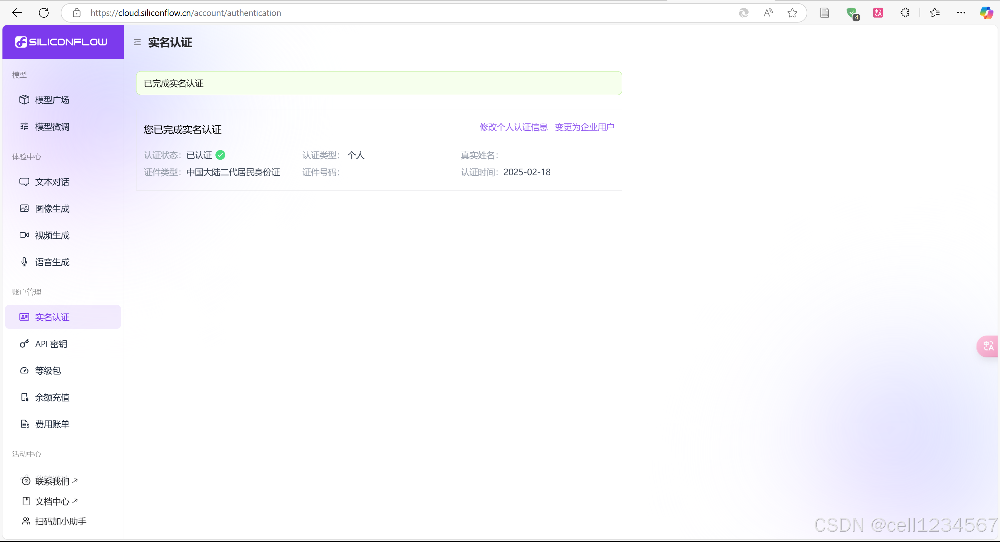
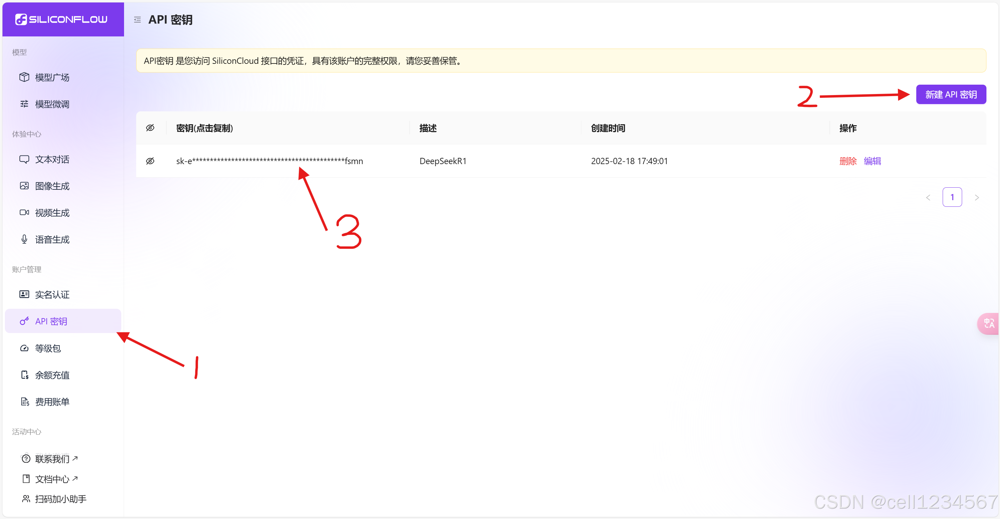

# 语音识别服务使用教程

## 硅基流动API获取（国内用户首选）

硅基流动是国内用户获取AI服务的便捷途径，无需科学上网即可使用。

1. 首先去硅基流动注册一个账号
2. 注册好账号后，点击左侧的"实名"，完成实名认证
3. 然后点击"密钥"（密钥描述没有影响）
4. 新建完成后点击指向3的字符串即可完成复制

硅基流动的API密钥可以作为本项目Docker镜像的环境变量，然后硅基流动API的地址(https://api.siliconflow.cn)可以作为本项目Docker镜像的环境变量，为国内用户提供便捷的语音识别服务。

## Groq API获取（国外用户首选）

Groq是一家美国AI芯片公司，专注设计高性能的AI处理器，目前借助自研的AI芯片LPU，每秒能够输出近几百甚至几千个token。同一个问题所需的时间，Groq完全碾压了其他传统的依赖GPU推理的AI推理服务。

目前国内环境下Groq使用起来不是太方便，而且国外很多网络也不能通畅访问Groq。下面教大家一个方法来实现代理访问Groq，从而体验Groq超快速度。

## Groq注册流程

1. 访问Groq官网 https://groq.com/

::: tip
需要使用代理工具，代理到美国或者日本节点访问，比如[clash](https://github.com/clash-verge-rev/clash-verge-rev)，需要使用谷歌账户注册(使用Github登录可能会被拒绝，感谢@labmem no.1219树灵藤蔓的反馈)
:::

2. 成功访问后可以看到Groq的主界面

## API密钥限制

Groq平台提供个人免费的API密钥，这里我们需要这个API密钥调用它们的Whisper API以获得快速的语音转文本服务：

目前Groq的Whisper API限制如下：
- 每分钟请求次数: 20次

这个限制对于个人使用来说通常是足够的。

## 获取API密钥

1. 访问 https://console.groq.com/keys
2. 注册/登录Groq账号
3. 点击"Create API KEY"按钮
4. 为你的API Key命名
5. 在弹出的对话框中复制API Key并保存，API Key是本项目Docker镜像的环境变量之一,Groq 的 API 地址(https://api.groq.com/openai)是本项目Docker镜像的环境变量之一

::: warning
请妥善保管你的API Key，不要泄露给他人。
:::
