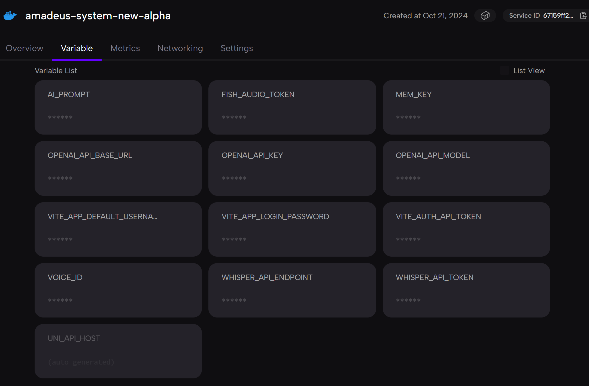

# 部署方法

## 使用 Zeabur 一键部署前端(推荐)

[](https://zeabur.com/templates/LMSUDW?referralCode=aipoet)

### 部署步骤

1. 点击上方的 "Deploy to Zeabur" 按钮
2. 如果你还没有 Zeabur 账号，需要先[注册](https://zeabur.com?referralCode=aipoet)。需要花费$5开通Developer计划,可使用WildCard虚拟信用卡开通,也可直接使用支付宝充值余额支付。
3. 点击上方按钮一键部署到香港AWS Tokyo区域(注意ASR使用Groq的用户不能部署到香港，否则无法语音识别)，等待部署完成，然后如下图，填写环境变量，最后再点击Networking，生成域名，你就可以通过 Zeabur 提供的域名访问你的应用了



### 环境变量配置说明

| 环境变量 | 说明 |
|---------|------|
| `VITE_APP_DEFAULT_USERNAME` | 用于前端登录系统鉴权的用户名，从而让Amadeus识别你的身份 |
| `VITE_APP_LOGIN_PASSWORD` | 用于前端登录系统鉴权的密码 |
| `WEBRTC_API_URL` | WebRTC服务的API转发地址，用于建立实时音视频通信 |

::: info 其他AI配置
其余所需AI配置（如OpenAI、Fish Audio、Whisper等）现已移至前端界面填写，用户可以在登录系统后根据需要灵活配置。这种方式更加灵活，避免了重新部署时需要重设环境变量的麻烦。
:::

- 确保你的项目符合 Zeabur 的部署要求
- 如果你需要自定义域名，可以在 Zeabur 的控制面板中进行设置
- 建议查看 [Zeabur 的官方文档](https://zeabur.com/docs) 获取更多部署相关信息

## 使用 Docker Compose 部署前端

如果你想在自己的服务器上部署，可以使用 Docker Compose 进行部署。

### 准备工作

1. 确保你的服务器已安装 [Docker](https://docs.docker.com/get-docker/) 和 [Docker Compose](https://docs.docker.com/compose/install/)
2. 准备好基础环境变量（用户名、密码和WebRTC API地址）

### Docker Compose 配置

创建 `docker-compose.yml` 文件，内容如下：

```yaml
version: '3'
services:
  container:
    image: ghcr.io/ai-poet/amadeus-system-new-alpha
    ports:
      - "3002:3002"  # 服务端口
    environment:
      - VITE_APP_DEFAULT_USERNAME=${VITE_APP_DEFAULT_USERNAME}
      - VITE_APP_LOGIN_PASSWORD=${VITE_APP_LOGIN_PASSWORD}
      - WEBRTC_API_URL=${WEBRTC_API_URL}
    restart: unless-stopped
    networks:
      - amadeus-network
    volumes:
      - ./logs:/app/service/logs  # 日志持久化存储
networks:
  amadeus-network:
    driver: bridge
```

### 部署步骤

1. 创建 `.env` 文件，填入所需的基础环境变量：
```
VITE_APP_DEFAULT_USERNAME=你的用户名
VITE_APP_LOGIN_PASSWORD=你的密码
WEBRTC_API_URL=你的WebRTC API转发地址
```

2. 在 `docker-compose.yml` 所在目录运行：
```bash
docker-compose up -d
```

3. 服务将在后台启动，可以通过以下命令查看日志：
```bash
docker-compose logs -f
```

::: tip 前端配置说明
首次登录系统后，你需要在设置页面中配置各种API服务的密钥和端点。系统会保存这些配置，无需每次登录都重新填写。
:::

## 自行部署WebRTC服务

如果不使用我在Zeabur模板中提供的我自行部署的WebRTC服务，也可以单独自行部署WebRTC服务。

### Docker方式部署WebRTC

1. 克隆仓库后，进入代码仓库的`service/webrtc`文件夹
2. 使用Dockerfile构建WebRTC服务镜像：

```bash
cd service/webrtc
docker build -t amadeus-webrtc-service .
```

3. 运行WebRTC服务容器：

```bash
docker run -d --name amadeus-webrtc \
  -p 80:80 -p 443:443 -p 3478:3478 -p 5349:5349 -p 49152-65535:49152-65535/udp \
  amadeus-webrtc-service
```

### 端口配置要求

部署WebRTC服务时，需要确保服务器以下端口已开放：

- `80`: HTTP通信
- `443`: HTTPS通信
- `3478`: STUN/TURN服务（TCP）
- `5349`: STUN/TURN服务（TLS）
- `49152-65535`: 媒体流端口范围（UDP）

::: warning 注意
如果使用云服务提供商（如AWS、阿里云等），请确保在安全组/防火墙设置中开放这些端口。
:::

### TURN服务器部署

在生产环境中，为了处理复杂网络环境下的音视频穿透问题，通常需要部署TURN服务器。你可以：

1. 自行部署Coturn
2. 参考[FastRTC部署文档](https://fastrtc.org/deployment/#self-hosting)进行AWS自动化部署

#### 使用AWS自动部署TURN服务器

FastRTC提供了一个自动化脚本，可在AWS上部署TURN服务器：

1. 克隆FastRTC部署仓库
2. 配置AWS CLI并创建EC2密钥对
3. 修改参数文件，填入TURN用户名和密码
4. 运行CloudFormation脚本自动部署

详细步骤请参考[FastRTC的自托管部署指南](https://fastrtc.org/deployment/#self-hosting)。

部署完成后，可在WebRTC服务的代码中填入TURN服务器信息：

```json
{
  "iceServers": [
    {
      "urls": "turn:你的TURN服务器IP:3478",
      "username": "你设置的用户名",
      "credential": "你设置的密码"
    }
  ]
}
```

::: tip 提示
正确配置TURN服务器后，即使在复杂的网络环境（如对称NAT、企业防火墙后）也能保证音视频通信的稳定性。
:::

