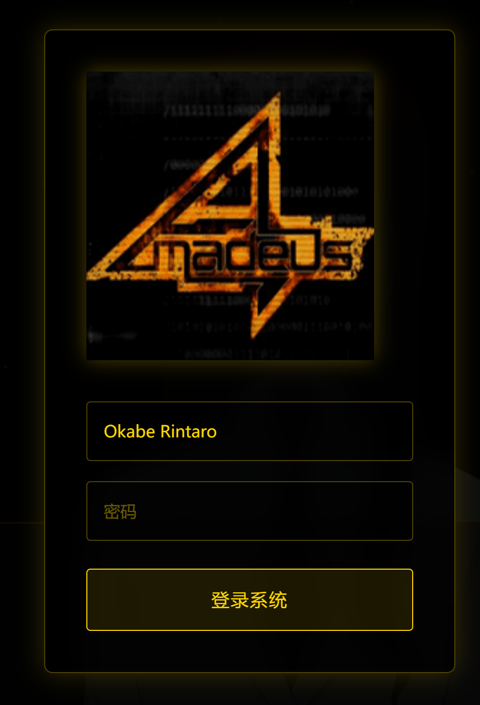
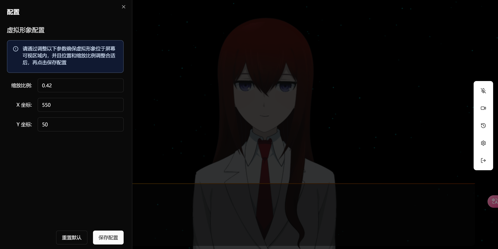
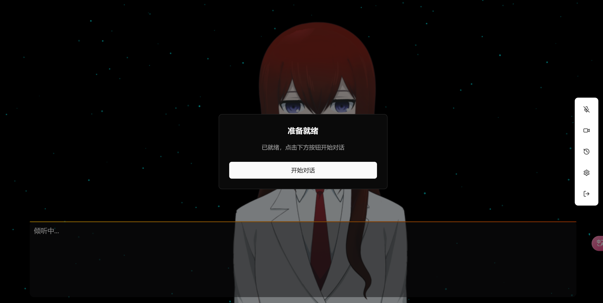

# 系统初始化和登录指南

## 1. 系统登录

系统提供了登录界面，请按照以下步骤进行操作。

### 登录步骤

1. 首先，请寻找一个安静的，无人说话打扰的环境，通过浏览器打开系统登录界面
2. 输入你在Docker镜像中设置的用户名和密码
3. 点击"登录系统"

## 2. 系统初始化

系统初始化是使用系统的第一步，请按照以下步骤进行操作。

### 2.1 初始化步骤

1. 首次登录系统后，系统会自动进入初始化配置界面
2. 设置虚拟形象的基本参数，主要是调整虚拟形象的缩放比例和位置

3. 点击"开始对话"按钮

4. 系统会自动开始对话，你只需要等待Amadeus的问候即可，此时你可以选择按F11全屏进入沉浸模式，并且你可以随时通过说话来中断Amadeus的发言
