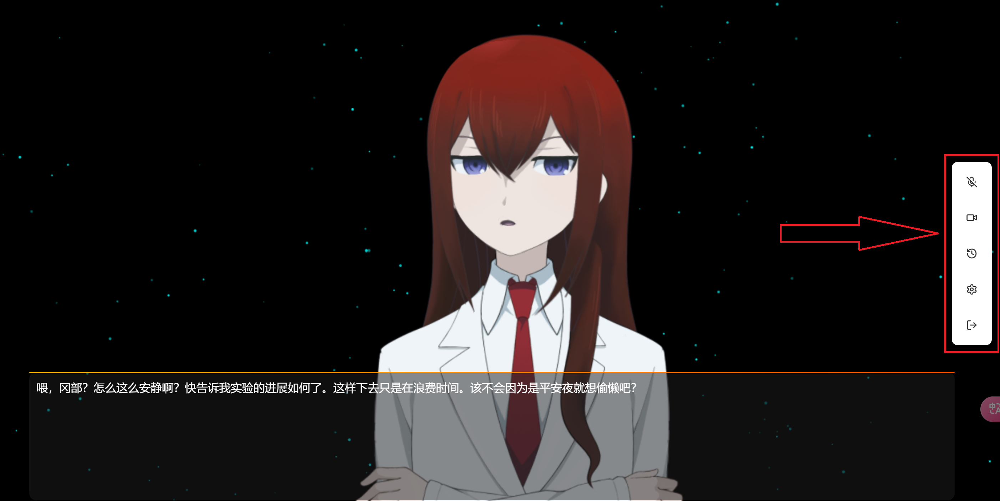

# 系统工具栏说明

## 工具栏功能介绍

系统工具栏位于界面右侧，包含了与 Amadeus 交互所需的所有功能按钮。

### 工具栏按钮说明

从上到下依次为：

1. **麦克风按钮**
   - 控制麦克风的开启和关闭
   - 开启状态下可以与 Amadeus 进行语音对话
   - 关闭状态下 Amadeus 将无法听到你的声音

2. **摄像头按钮**
   - 控制摄像头的开启和关闭
   - 开启后，Amadeus 将能够观察摄像头前的情况
   - 关闭状态下 Amadeus 将无法看到摄像头画面

3. **对话记录按钮**
   - 查看与 Amadeus 的历史对话记录
   - 可以回顾之前的交互内容

4. **设置按钮**
   - 打开系统设置界面
   - 可以调整系统参数和偏好设置

5. **退出按钮**
   - 安全退出系统
   - 点击后将结束与 Amadeus 的对话

::: tip 提示
建议在使用前先检查麦克风和摄像头是否正常工作。
:::

::: warning 注意
首次使用时，浏览器可能会请求麦克风和摄像头的使用权限，请选择"允许"以确保功能正常使用。
:::

## 使用建议

1. **语音交互**
   - 确保在安静的环境中使用麦克风
   - 说话语速适中，语气自然
   - 可随时说话打断AI的语音

2. **视觉交互**
   - 保持摄像头画面清晰
   - 确保光线充足

3. **系统设置**
   - 根据你的屏幕分辨率调整虚拟形象的参数

::: info 补充说明
如果对话过程中遇到异常或者阻塞，可以尝试刷新页面或重新登录系统
:::
